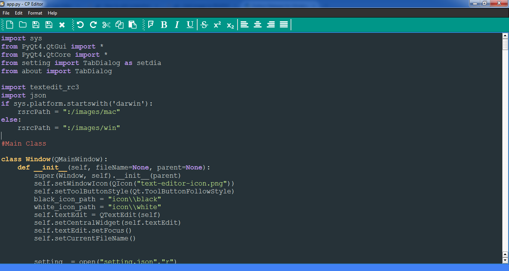
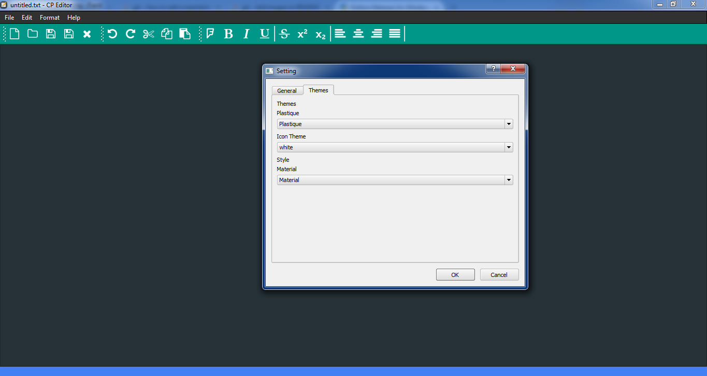
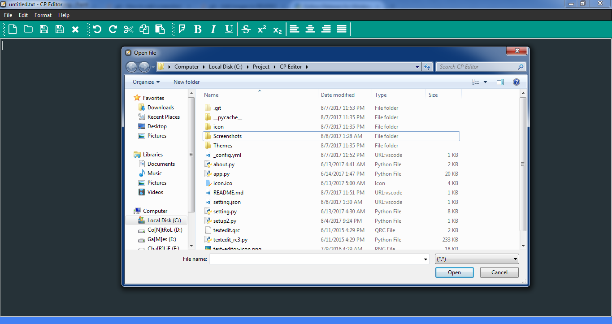
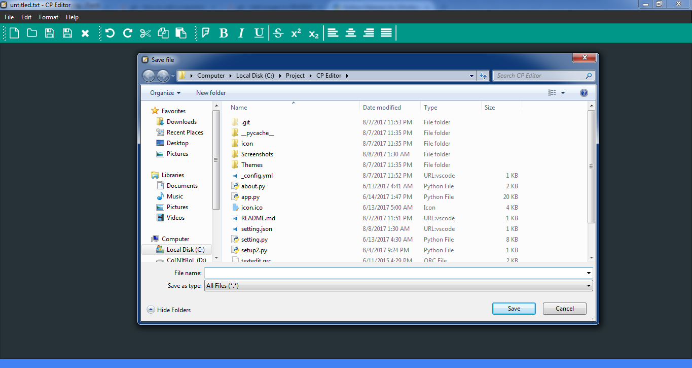

# Freeware Editor by using Python module for GUI Application Development PyQt5, JSON, CSS.
-----------------------------------------------------------------------------------

# Some features are:
1. Support Basic Editor functionality such as (Open. Save, Edit, etc.).
2. Redo, Undo, Alignment, Font option
3. Syntax Highlighting (Support Python)
4. Printing Files.
5. Support file extension such as “.txt”, “.html”, ”py” and many more.
6. In-Built setting menu including themes, font settings & used JSON to save settings.

To Run:
1. Install Python
2. pip PyQt4 or u can Download and install PyQt4
3. Open app.py
4. Enjoy and feel free to comment.

ScreenShoots:

<iframe width="560" height="315" src="https://www.youtube.com/embed/UXla3nhGnVU" frameborder="0" allowfullscreen></iframe>

Thank You.